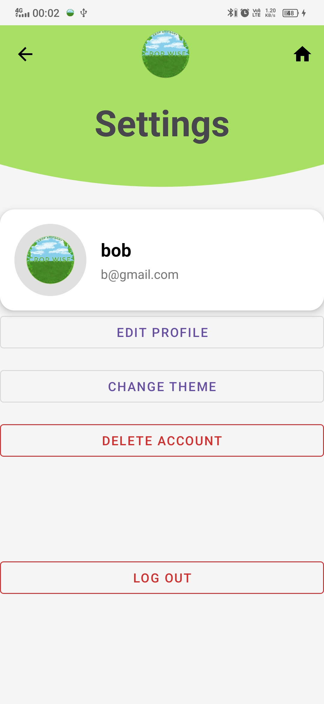

# CropWise

  

### *An android application for smart farming advisory and precision farming companion*

  

  
  
  
  
  
  
  
  
  
  
  
  
  
  
  
  

## Table of Content
| Content                                         |
|-------------------------------------------------|       
| 👋🏼 [Introduction](#content-introduction)      |
| 🌟 [Current Features](#content-currentfeatures) |
| 🔮 [Planned Features](#content-plannedfeatures) | 

## 
Introduction 👋🏼

"*An android application for smart farming advisory and precision farming companion*"

## Contributors:

    
     
    

## Aim of the application
### A mobile app to enhance productivity and sustainability for farmers by offering them:
- Personalized agricultural advice
- Crop management tips
- Precision farming tools

---

## 
Current features 🌟

### Providing advise on farming
- Daily Tips and some curated tips

### Reminders
Assists by keeping the farmer well informed

## 
Planned features 🔮

### Compatibility with lower android versions
Opens the access to the larger market of poorer farmers

### Providing advise on farming
Tips for timing windows on when to sow, apply fertilizers or reap the crop

### Crop tracker
Tracking for the timing windows on when to sow, apply fertilizers and reap the crop for a specific batch of crops
Photo reference for easier geo tracking

### Weather forecast for early preparing for any weather phenomenon

### Calendar view for better time management

### GPS-powered precision farming
Distance tracking
Area covered

### Notifications
Alerts of concerning weather phenomenon

### Contact Numbers for local emergency services
For quick and easy access to emergency services